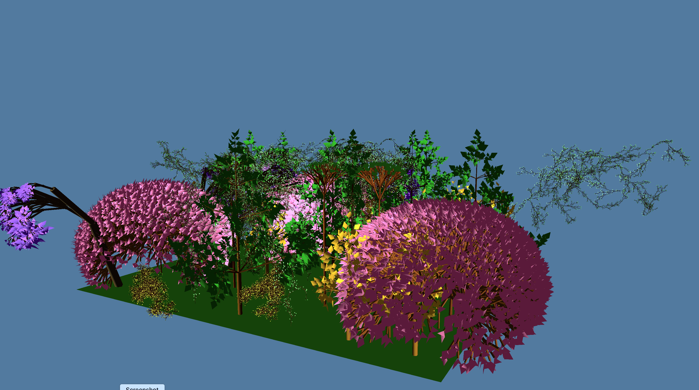

# FractalEngine 🌿
Procedural generation and real-time rendering of **plant-like fractals** using **L-Systems**.  
The project combines a **Python grammar engine** (rule expansion & geometry export) with a custom **C++ OpenGL renderer**.  
As a bonus, it includes **mesh optimisation** (CGAL) and **reproducible experiments** (CSV logs, scripts).

<p align="center">
  
</p>


---

## ✨ Features
- **L-Systems**: standard, stochastic, and parametric production rules  
- **Geometry export**: generate meshes and save as `.obj`  
- **C++/OpenGL renderer**: GLFW • GLAD • GLM • ImGui; custom shaders (GLSL)  
- **Optimisation (optional)**: CGAL-based mesh simplification with controllable ratio  
- **Experiments**: batch scripts + CSV metrics for repeatable tests

---

## 🧭 Repository Structure (high-level)

```text
lsysGrammar/    # L-System rules, Python generation, notebooks/scripts
src/            # C++ renderer (loading, camera, UI, draw loop)
shaders/        # GLSL vertex/fragment shaders
results/        # generated meshes / optimisation outputs / CSV logs
plotting/       # small analysis/visualisation utilities (Python)
tests/          # experiments and validation
vendor/         # third-party deps (headers/libs)
optimize_all.py # batch optimisation helper
CMakeLists.txt  # C++ build configuration
```
---

## 🛠 Tech Stack
**Python** (generator, experiments) • **C++17 / OpenGL** (real-time rendering) • **GLSL** (shaders) • **CGAL** (mesh simplification) • **CMake**


---

## ▶️ Quick Start

### 1) Run the generator + converter
```bash
# from the folder that contains main.py, grammar.py, generator.py
cd lsysGrammar
python3 main.py
```

> Running this command will:
> - expand the L-system(s) defined in `main.py`
> - save the intermediate expansions as `.txt` in `GoldenOaktree/`
> - convert them to `.obj` meshes in `GoldenOaktree_obj/`

---

### 2) (Optional) Convert an existing folder of .txt files to .obj
```bash
cd lsysGrammar
python3 -c 'from generator import process_lsystems_in_folder; process_lsystems_in_folder("GoldenOaktree","GoldenOaktree_obj")'
```

---

### 3) Build & run the C++ renderer
```bash
mkdir -p build && cd build
cmake ..
make -j

# run the viewer on a generated mesh
./FractalEngine ../lsysGrammar/GoldenOaktree_obj/GoldenOaktree__parametric__iter_7.obj
```

---

### Dependencies
- Python 3.x with `numpy`, `open3d`
- C++17 toolchain with CMake, OpenGL, GLFW, GLAD, GLM, ImGui

---

## 📊 Results & Reproducibility
- Experiments log **faces/vertices before/after**, **execution time**, and chosen **simplification ratio**.  
- CSV samples live under `results/` (e.g., `render_*.csv`).  
- The renderer is used to visually inspect fidelity after simplification.

| Model        | Faces → After | Reduction | Time (s) |  
|--------------|---------------|-----------|----------|  
| fern.obj     | 120k → 60k    | -50%      | 1.9      |  
| tree.obj     | 180k → 90k    | -50%      | 2.7      |  

---

## 🧠 How it works (high level)
1. **L-System expansion (Python)** → apply production rules (incl. stochastic/parametric).  
2. **3D turtle interpretation** → build vertices/faces and **export `.obj`**.  
3. **OpenGL renderer (C++)** → load mesh, camera controls, shader pipeline, ImGui UI.  
4. **(Optional) CGAL simplification** → reduce complexity while preserving visual quality; record metrics.

---

## 🎓 Academic Context
Bachelor’s thesis — **University POLITEHNICA of Bucharest, Faculty of Automatic Control and Computers (2025)**  
Topics: **procedural generation**, **computational geometry**, **real-time graphics**, **mesh optimisation**.

---

## 💡 Why it matters
- Clear separation of **generation ↔ rendering ↔ optimisation**, showcasing pipeline engineering  
- Mix of **Python scripting** and **C++ real-time systems**  
- Solid base for research demos or production-style tooling (exportable assets, benchmarks)
